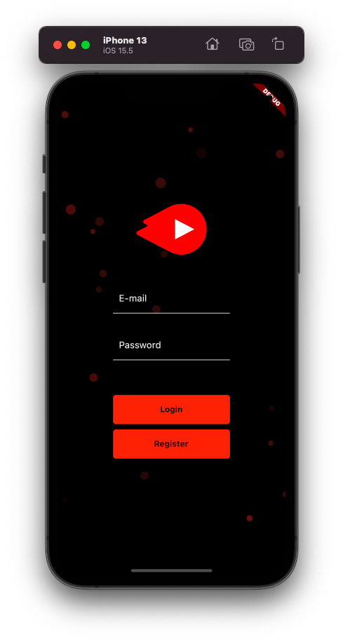
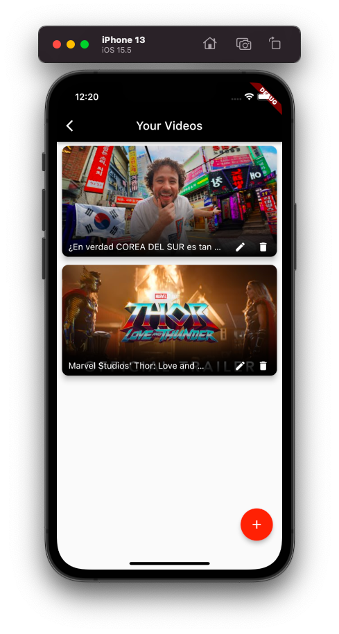
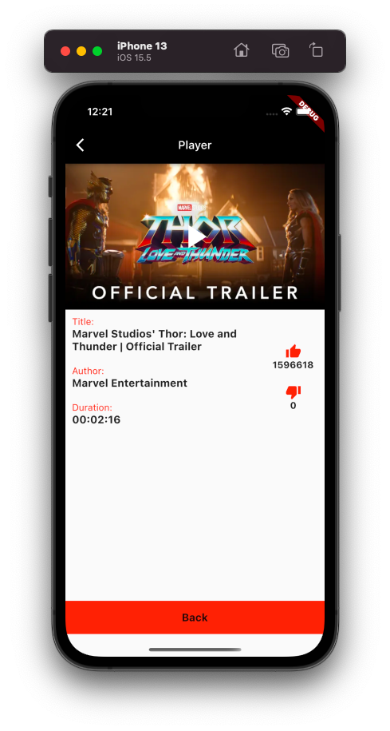

# Personal YouTube app.

App in Flutter, which alows save and reproduce YouTube videos by simple passing the ID of the video.
- App uses Firebase authentication to sign in.
- Save the videos in Firestore.
- Reproduce the video using youtube_player_flutter package.
- Get video metadata using youtube_explode_dart (using YouTube API).

https://user-images.githubusercontent.com/78172208/183766225-41611d09-32d1-447b-a804-65ce2d62cd45.MOV

